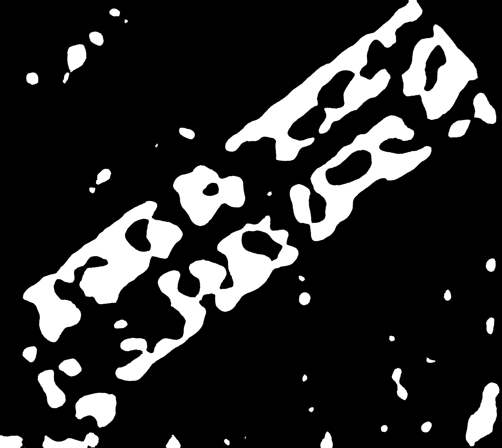

# 🛰️ Ottermap Open Vision Challenge

## Overview

This project implements an end-to-end semantic segmentation pipeline for detecting **Turf/Grass** regions from aerial imagery. The pipeline converts annotated GeoJSON data into training masks, trains a U-Net model, and generates GIS-compatible GeoJSON outputs from predicted masks.

---

## Features

* GeoJSON preprocessing
* Binary mask generation
* Image tiling
* U-Net (ResNet34) semantic segmentation
* Prediction mask generation
* Overlay visualization
* GeoJSON export

---

## Project Structure

```text
├── data/
├── models/
├── outputs/
├── scripts/
├── train.py
├── inference.py
├── polygonize.py
├── requirements.txt
└── README.md
```

---

## Model

| Parameter     | Value    |
| ------------- | -------- |
| Model         | U-Net    |
| Encoder       | ResNet34 |
| Framework     | PyTorch  |
| Epochs        | 15       |
| Batch Size    | 4        |
| Learning Rate | 0.0001   |

---

## Installation

```bash
git clone https://github.com/satakshisingh1610/ottermap-open-vision-challenge-Satakshi-Singh.git

cd ottermap-open-vision-challenge-Satakshi-Singh

pip install -r requirements.txt
```

---

## Training

```bash
python train.py
```

---

## Inference

```bash
python inference.py --image data/images/1.jpg
```

---

## Generate GeoJSON

```bash
python polygonize.py
```

---

## Sample Results

### Prediction Mask



### Overlay


---

## Technologies

* Python
* PyTorch
* segmentation-models-pytorch
* OpenCV
* GeoPandas
* NumPy
* Shapely

---

## Author

**Satakshi Singh**

B.Tech Computer Science (Data Science)
